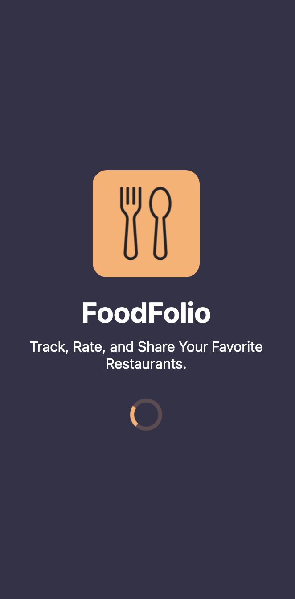
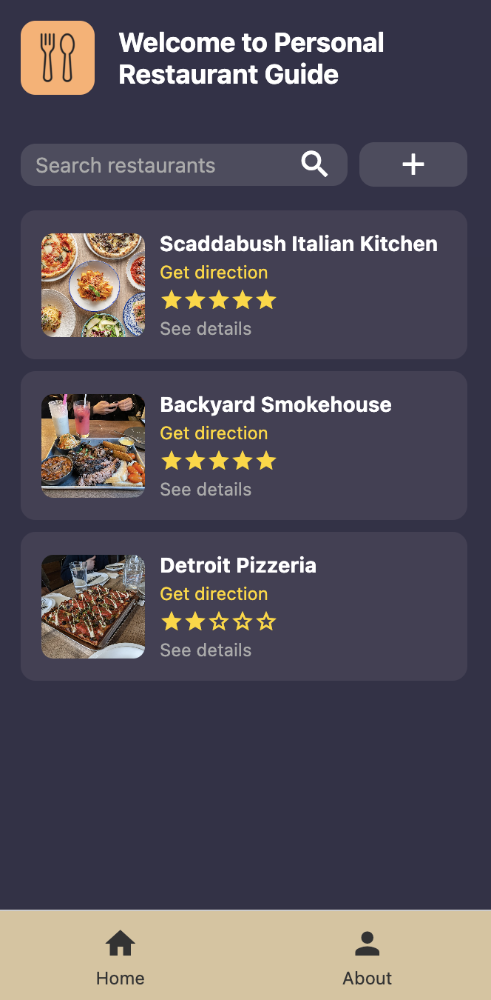
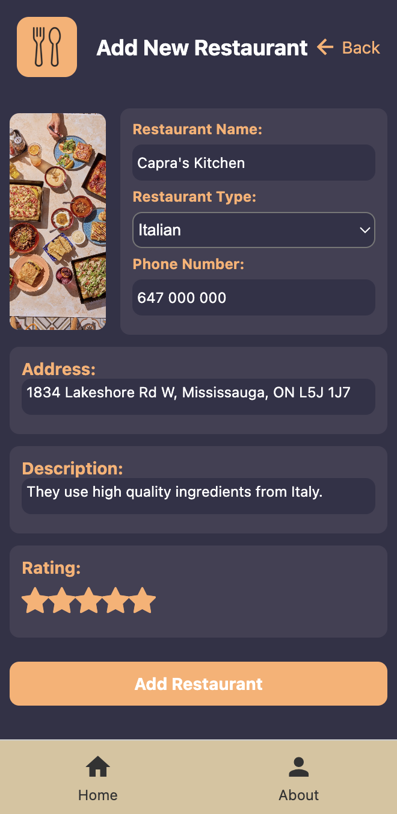
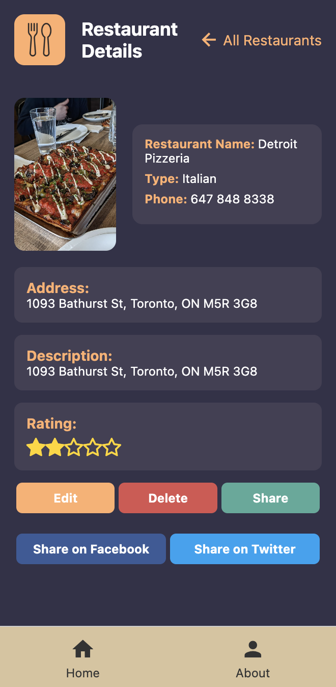
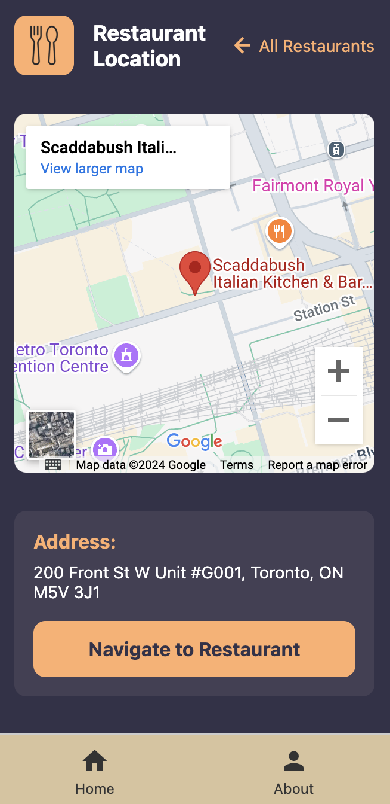
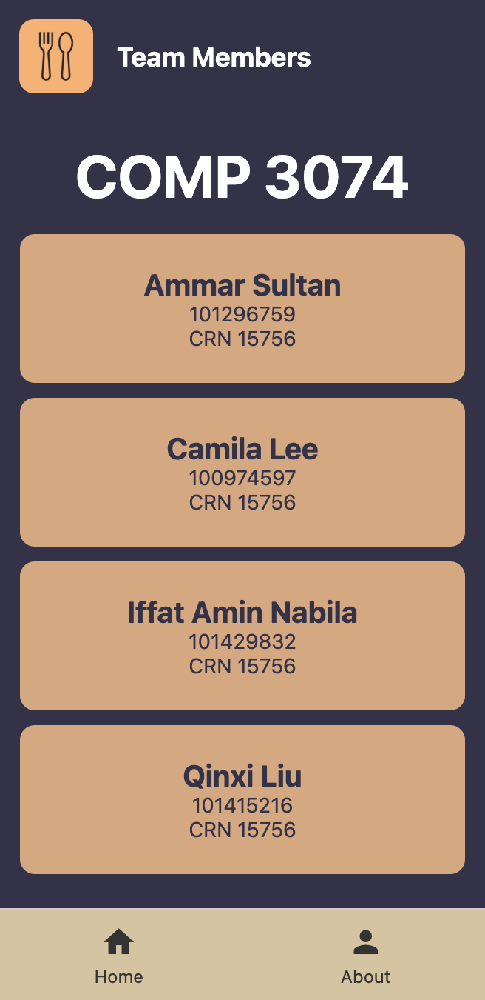

# Personal Restaurant Guide

Welcome to **Personal Restaurant Guide**, a React Native application to track, rate, and share your favorite restaurants. This application provides functionalities for restaurant management, including adding, editing, deleting, and viewing details about restaurants.

## Features

- **Restaurant Management**: Add, edit, delete, and view restaurant details.
- **Search Functionality**: Easily search for your favorite restaurants by name.
- **Interactive Maps**: View restaurant locations and navigate using Google Maps.
- **Rating System**: Rate restaurants with a 5-star system.
- **Social Sharing**: Share restaurant details via Facebook, Twitter, or other platforms.
- **Elegant UI**: A beautiful and responsive design with a modern look.

## Screenshots

_Add screenshots of your application below._

| Splash Screen                             | Home Screen                           | Add Restaurant                          |
| ----------------------------------------- | ------------------------------------- | --------------------------------------- |
|  |  |  |

| Details Screen                              | Map Screen                          | About Screen                            |
| ------------------------------------------- | ----------------------------------- | --------------------------------------- |
|  |  |  |

## How to Run the App

1. Clone the repository:
   ```bash
   git clone https://github.com/ammar-sultan/FoodFolio-Prototype
   ```
2. Navigate to the project directory:
   ```bash
   cd FoodFolio-Prototype
   ```
3. Install dependencies:
   ```bash
   npm install
   ```
4. Start the development server:
   ```bash
   npm start
   ```
5. Run on your device or emulator:
   - For Android:
     ```bash
     npm run android
     ```
   - For iOS (MacOS only):
     ```bash
     npm run ios
     ```

## Technologies Used

- **React Native**: Cross-platform mobile development framework.
- **Expo**: For rapid development and testing.
- **AsyncStorage**: Local storage for managing restaurant data.
- **Google Maps API**: For geolocation and map services.
- **React Navigation**: For seamless navigation between screens.

## File Structure

```plaintext
root
├── components
│   ├── AboutScreen.js
│   ├── AddRestaurant.js
│   ├── EditRestaurant.js
│   ├── HomeScreen.js
│   ├── MapScreen.js
│   ├── NavBar.js
│   ├── RestaurantDetail.js
│   ├── SplashScreen.js
├── assets
│   ├── logo.png
│   ├── restaurant.png
├── App.js
├── database.js
├── README.md
```

## Contributing

Contributions are welcome! Feel free to open an issue or submit a pull request for improvements or bug fixes.

## License

This project is licensed under the MIT License. See the LICENSE file for details.

## Contact

For any inquiries, please contact us.
